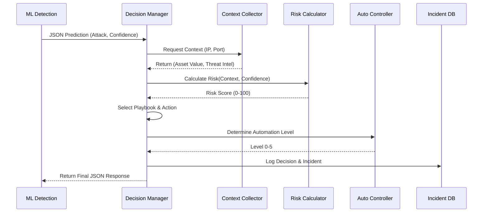
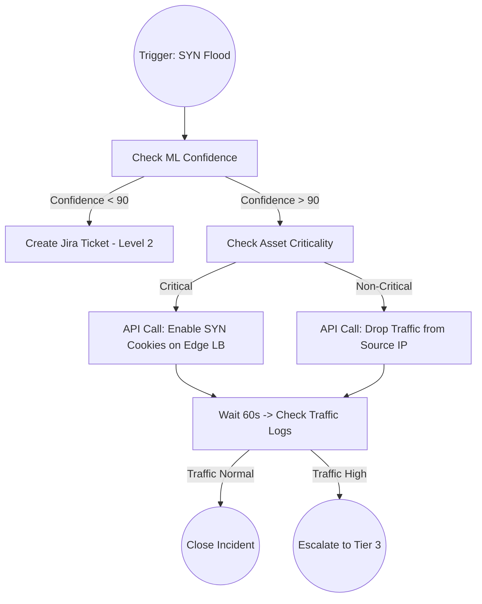

# Smart SOC Manager: Decision Engine
## Enterprise Software Design & Technical Architecture Document

---

## Document Control
| Version | Date | Author | Description |
|---------|------|--------|-------------|
| 1.0 | 2026-07-30 | AI Architect | Initial Architecture Design for Decision Engine |

---

## Chapter 1: Introduction

### 1.1 What is a SOC?
A Security Operations Center (SOC) is a centralized function within an organization employing people, processes, and technology to continuously monitor and improve an organization's security posture while preventing, detecting, analyzing, and responding to cybersecurity incidents.

### 1.2 Security Incident Response
Incident Response (IR) is the methodology an organization uses to respond to and manage a cyberattack. An effective IR strategy aims to limit damage, reduce recovery time, and mitigate costs. Traditional IR relies heavily on manual log analysis, which is slow and error-prone.

### 1.3 Why Decision Engines are Required
As network traffic volumes and attack sophistication increase, human analysts suffer from "alert fatigue." A Decision Engine sits at the core of an autonomous SOC, bridging the gap between detection (AI/ML models) and response. It contextualizes alerts, calculates risks, and determines the best course of action without human intervention.

### 1.4 Problems with Manual Incident Response
* **Alert Fatigue:** Analysts are overwhelmed by thousands of daily alerts, many of which are false positives.
* **Slow Response Times:** Manual triage takes minutes to hours, giving attackers time to exfiltrate data or disrupt services.
* **Inconsistent Decisions:** Different analysts may respond to the same threat differently based on their experience level.

### 1.5 Need for Automated Decision Making
Automated decision-making brings machine-speed response to cybersecurity. By using deterministic logic and context enrichment, the Decision Engine ensures consistent, immediate, and accurate remediation of threats like DoS floods and brute force attacks.

---

## Chapter 2: Decision Engine Fundamentals

### 2.1 Definition
The Decision Engine is the centralized intelligence module of the Smart SOC Manager. It receives predictions from the ML layer, evaluates the context, calculates a risk score, and determines the optimal remediation strategy.

### 2.2 Objectives
* Eliminate false positives from escalating to Tier 1 analysts.
* Provide machine-speed responses to high-confidence attacks.
* Standardize incident response procedures via automated playbooks.

### 2.3 Scope
The scope of this engine includes ingesting XGBoost predictions, prioritizing incidents, recommending actions, enforcing automation levels, and logging all automated decisions. It does NOT include ML training or actual execution of firewall rules (handled by the Action Executor).

### 2.4 Responsibilities
* **Contextualization:** Gathering asset criticality and threat intelligence.
* **Risk Assessment:** Generating a dynamic risk score.
* **Policy Enforcement:** Deciding the automation level (0-5).
* **Playbook Selection:** Mapping the attack type to a specific response playbook.

### 2.5 Inputs and Outputs
**Inputs:** Attack Type, Confidence Score, Probability, Timestamp, Source/Dest IPs, Ports, Protocol, Packet Count, Flow Duration.
**Outputs:** JSON payload containing Risk Score, Severity, Recommended Action, Playbook ID, and Automation Level.

### 2.6 Requirements
* **Functional:** Must evaluate rules in < 50ms. Must support JSON API. Must log to DB.
* **Non-Functional:** High availability (99.99%), horizontally scalable, secure (encrypted data in transit).

---

## Chapter 3: Enterprise SOAR Research

### 3.1 Cortex XSOAR Decision Logic
Palo Alto's Cortex XSOAR uses highly customizable playbooks based on YAML and Python scripts. Its decision engine evaluates incident data against playbook conditions in real-time, relying on pre-built integrations for context enrichment.

### 3.2 Microsoft Sentinel Automation Rules
Sentinel uses Automation Rules to centrally manage automation. It triggers Azure Logic Apps (playbooks) based on incident creation, alerts, or analytics rules. Its decision logic is highly integrated with Azure Active Directory and Microsoft Graph.

### 3.3 Splunk SOAR Playbooks
Formerly Phantom, Splunk SOAR uses Visual Playbook Editor (VPE) which translates to Python code. It excels at orchestration, using decision blocks (if/else) based on normalized CEF (Common Event Format) data.

### 3.4 IBM QRadar SOAR
QRadar SOAR uses a dynamic "Incident Response Plan" that adapts as new information is uncovered. Its decision engine utilizes "Rules" and "Scripts" to trigger specific phases of a playbook automatically.

### 3.5 Architectural Comparison & Application
Modern SOAR platforms separate the **Event Ingestion**, **Decision/Logic**, and **Orchestration** layers. Our Smart SOC Manager will adopt this decoupled architecture. The Decision Engine acts as the central router: parsing the event, applying static/dynamic rules, and assigning a playbook before passing it to the Orchestration layer.

---

## Chapter 4: Decision Engine Architecture

The architecture is highly modular, ensuring each component handles a single responsibility.

### 4.1 Modules
1. **Context Collector:** Enriches the bare ML prediction with Asset Data, Threat Intel, and Historical Context.
2. **Risk Calculator:** Computes a mathematical risk score (0-100).
3. **Policy Engine:** Evaluates business rules (e.g., "Never block CEO's IP").
4. **Decision Manager:** The orchestrator of the engine; chains the modules together.
5. **Playbook Selector:** Maps the incident to `PB-NET-XXX`.
6. **Action Recommendation Engine:** Formulates the specific remediation steps.
7. **Automation Controller:** Determines if the action should be executed automatically (Levels 0-5).
8. **Incident Logger:** Commits the final decision to the database.
9. **Dashboard API:** Exposes the decision to the frontend.

### 4.2 ASCII Architecture Diagram

```text
+-----------------------------------------------------------------------------------+
|                               SMART SOC MANAGER                                   |
+-----------------------------------------------------------------------------------+
|  +--------------------+       +------------------------------------------------+  |
|  |   ML DETECTION     |       |               DECISION ENGINE                  |  |
|  |   (XGBoost)        |       |                                                |  |
|  | - Attack Type      |=====> |  +-------------------+   +------------------+  |  |
|  | - Confidence       |       |  | Context Collector |-->| Risk Calculator  |  |  |
|  | - Probabilities    |       |  +-------------------+   +------------------+  |  |
|  +--------------------+       |            |                      |            |  |
|                               |            v                      v            |  |
|  +--------------------+       |  +-------------------+   +------------------+  |  |
|  |   THREAT INTEL     |=====> |  |   Policy Engine   |<--| Decision Manager |  |  |
|  |   (Reputation)     |       |  +-------------------+   +------------------+  |  |
|  +--------------------+       |            |                      |            |  |
|                               |            v                      v            |  |
|  +--------------------+       |  +-------------------+   +------------------+  |  |
|  |   ASSET DB         |=====> |  | Playbook Selector |-->| Action Recomm.   |  |  |
|  |   (Criticality)    |       |  +-------------------+   +------------------+  |  |
|  +--------------------+       |                                   |            |  |
|                               |                                   v            |  |
|                               |  +-------------------+   +------------------+  |  |
|                               |  |  Incident Logger  |<--| Automation Ctrl. |  |  |
|                               |  +-------------------+   +------------------+  |  |
|                               +-----------|-----------------------|------------+  |
|                                           |                       |               |
|                                           v                       v               |
|                               +-------------------+   +------------------------+  |
|                               |   Dashboard API   |   |   SOC Action Executor  |  |
|                               +-------------------+   +------------------------+  |
+-----------------------------------------------------------------------------------+
```

### 4.3 UML Sequence Diagram



---

## Chapter 5: Decision Logic

The core decision logic follows a deterministic flow based on confidence, risk, and asset value.

### 5.1 Primary Decision Tree

```mermaid
graph TD
    A[Receive Prediction] --> B{Is Attack Benign?}
    B -- Yes --> C[Automation Level 0: Drop/Log]
    B -- No --> D{ML Confidence > 90%?}
    D -- No --> E[Automation Level 2: Notify Analyst]
    D -- Yes --> F{Risk Score > 80?}
    F -- No --> G[Automation Level 3: Recommend Action]
    F -- Yes --> H{Is Asset Critical?}
    H -- Yes --> I[Automation Level 4: Semi-Auto (Requires Approval)]
    H -- No --> J[Automation Level 5: Fully Auto Block]
```

### 5.2 Exception Handling Logic
* **Whitelist Override:** If Source IP is in the enterprise whitelist, automatically downgrade Risk to 0 and set Automation Level to 1 (Log Only).
* **Business Hours Modifier:** If an attack occurs outside business hours, the automation level is temporarily elevated by +1 to compensate for reduced human staff.

---

## Chapter 6: Risk Assessment

### 6.1 Methodology
Risk is not static; it is a product of the threat's severity, the certainty of the detection, and the vulnerability/value of the target.

### 6.2 Mathematical Framework

`Risk_Score = (W1 * Base_Severity) + (W2 * ML_Confidence) + (W3 * Asset_Criticality) + (W4 * Threat_Intel_Score) + (W5 * Frequency_Modifier)`

**Weights (Sum = 1.0):**
* `W1` (Severity): 0.35
* `W2` (Confidence): 0.25
* `W3` (Asset): 0.20
* `W4` (Intel): 0.10
* `W5` (Frequency): 0.10

**Variables (Normalized to 0-100):**
* **Base_Severity:** UDP Flood (80), SYN Flood (90), Brute Force (70), Benign (0).
* **ML_Confidence:** Provided directly by ML (e.g., 95% = 95).
* **Asset_Criticality:** Tier 1 Asset (100), Tier 2 (75), Tier 3 (50), Workstation (25).
* **Threat_Intel_Score:** Known malicious IP (100), Suspicious (50), Unknown (0).
* **Frequency_Modifier:** >1000 packets/sec (100), >500 (50), <100 (0).

### 6.3 Thresholds & Prioritization
| Risk Score | Priority | Severity | Action Baseline |
|------------|----------|----------|-----------------|
| 0 - 20     | P4       | LOW      | Log & Ignore |
| 21 - 50    | P3       | MEDIUM   | Investigate / Alert |
| 51 - 75    | P2       | HIGH     | Recommend Mitigation |
| 76 - 100   | P1       | CRITICAL | Automated Mitigation |

---

## Chapter 7: Attack-Specific Decision Logic

### 7.1 Benign Traffic
* **Description:** Normal, non-malicious network flow.
* **Severity:** None (0)
* **Playbook:** PB-NET-000-BENIGN
* **Recommended Action:** Ignore.
* **Automation Level:** Level 0 (Ignore) or Level 1 (Log).
* **Logging Strategy:** Sample 1% of benign traffic for historical baselining.

### 7.2 Dictionary Brute Force
* **Description:** Repeated login attempts using lists of common passwords.
* **Characteristics:** High Flow Duration, specific destination port (e.g., 22 for SSH, 3389 for RDP).
* **Business Impact:** Account compromise, data exfiltration.
* **Playbook:** PB-ID-001-BRUTEFORCE
* **Immediate Response:** Temporary IP block at the firewall (15 minutes).
* **Long-term Mitigation:** Enforce MFA, reset compromised credentials.
* **Automation Level:** Level 4 (Semi-Auto) - Block IP automatically, request approval for account suspension.

### 7.3 DoS DNS Flood
* **Description:** Overwhelming a DNS server with valid or malformed queries.
* **Risk Level:** High (Can disrupt all network routing).
* **Playbook:** PB-NET-002-DNS-FLOOD
* **Immediate Response:** Implement DNS Rate Limiting (Response Rate Limiting - RRL) on the edge router.
* **Recovery:** Flush DNS caches, verify zone integrity.
* **Automation Level:** Level 5 (Fully Auto) - Immediate rate limiting required to save infrastructure.

### 7.4 DoS ICMP Flood (Ping Flood)
* **Description:** Sending massive volumes of ICMP Echo Requests.
* **Risk Level:** Low to Moderate (Usually handled by modern firewalls).
* **Playbook:** PB-NET-003-ICMP-FLOOD
* **Immediate Response:** Drop external ICMP traffic at the perimeter.
* **Automation Level:** Level 5 (Fully Auto).

### 7.5 DoS SYN Flood
* **Description:** Exploiting the TCP handshake by sending continuous SYN packets without ACKing the SYN-ACK.
* **Business Impact:** Exhausts server connection tables, causing complete service outage.
* **Playbook:** PB-NET-004-SYN-FLOOD
* **Immediate Response:** Enable TCP SYN Cookies on the load balancer/firewall.
* **Recovery:** Terminate half-open connections.
* **Automation Level:** Level 5 (Fully Auto).

### 7.6 DoS UDP Flood
* **Description:** Flooding random ports on a target with UDP packets.
* **Risk Level:** High (Consumes massive bandwidth).
* **Playbook:** PB-NET-005-UDP-FLOOD
* **Immediate Response:** Rate limit UDP traffic. Null-route the source IP at the edge.
* **Automation Level:** Level 5 (Fully Auto).

---

## Chapter 8: Automation Levels

To maintain trust with human operators, the engine uses a 6-tier automation scale.

* **Level 0 (Ignore):** The engine drops the alert. No DB entry. (e.g., Benign traffic).
* **Level 1 (Log):** Incident is saved to the DB for compliance, but no alerts are generated.
* **Level 2 (Notify SOC Analyst):** Incident is logged and pushed to the dashboard as a manual ticket. Used for low-confidence detections.
* **Level 3 (Recommend Response):** Engine generates an incident and attaches a specific Playbook and Action recommendation. Analyst must click "Execute".
* **Level 4 (Semi-Automatic Response):** Engine executes non-destructive actions (e.g., isolating a container, rate limiting) immediately, but pauses for human approval before destructive actions (e.g., locking a domain admin account).
* **Level 5 (Fully Automatic Response):** Engine executes the entire playbook instantly without human intervention. Used for high-confidence DoS floods where milliseconds matter.

---

## Chapter 9: Playbook Design

### 9.1 Anatomy of a Playbook
1. **Trigger Condition:** E.g., `attack_type == 'DoS SYN Flood' && risk > 80`.
2. **Context Gathering:** Fetch current active connections on the target IP.
3. **Decision Branching:** If target is a Web Server -> Enable SYN Cookies. If target is a DB -> Block Source IP.
4. **Action Execution:** Generate API payload for the mock firewall.
5. **Verification:** Check if packet count drops after 30 seconds.
6. **Closure:** Resolve the incident ticket.

### 9.2 SYN Flood Playbook Flowchart



---

## Chapter 10: Decision Algorithms

### 10.1 Comparative Analysis
* **Rule-Based Systems (If/Else):** Extremely fast, highly predictable, easy to audit. Rigid.
* **Decision Trees (ML):** Good for complex logic, but acts as a "black box," making SOC analysts hesitant to trust it.
* **Fuzzy Logic:** Allows for degrees of truth (e.g., "Slightly malicious"). Computationally heavier.
* **Bayesian Networks:** Excellent for calculating probabilities of secondary attacks based on primary detection.

### 10.2 Selected Approach: Hybrid Rule + Expert System
The Smart SOC Manager will use a **Deterministic Rule-Based Expert System**. 
**Why?** In cybersecurity, predictability and auditability are paramount. If an automation script brings down the production database, the CISO needs to know exactly *why* the Decision Engine made that choice. Static threshold-based rules (Python `if/elif` mapped via Policy Engine) combined with dynamic Risk Math provide the perfect balance of intelligence and explainability.

---

## Chapter 11: Python Architecture

### 11.1 Directory Structure
```text
decision_engine/
│
├── core/
│   ├── __init__.py
│   ├── engine.py          # Main DecisionManager Class
│   ├── config.py          # Global thresholds & settings
│   └── logger.py          # Standardized JSON logger
│
├── context/
│   ├── __init__.py
│   ├── asset_db.py        # Mocks/Queries asset inventory
│   └── threat_intel.py    # Mocks external IP reputation
│
├── intelligence/
│   ├── __init__.py
│   ├── risk_calculator.py # Implements the math framework
│   └── policy_engine.py   # Evaluates Automation Levels
│
├── playbooks/
│   ├── __init__.py
│   ├── registry.py        # Maps Attack Types to Playbooks
│   └── templates/         # JSON representations of PB actions
│
├── api/
│   ├── __init__.py
│   ├── router.py          # FastAPI endpoints
│   └── schemas.py         # Pydantic models
│
└── models/
    ├── __init__.py
    └── enums.py           # AttackType, Severity, AutoLevel
```

### 11.2 Core Components Responsibilities
* `engine.py`: Exposes `process_prediction(prediction_data)`. It orchestrates calls to `context`, `intelligence`, and `playbooks`.
* `risk_calculator.py`: Contains the `calculate_risk()` method implementing the Chapter 6 formulas.
* `router.py`: Provides the REST API for the ML model to POST data to, and for the Dashboard to GET data from.

---

## Chapter 12: API Design

The Decision Engine exposes a RESTful API built with FastAPI.

### 12.1 Endpoints

**1. POST `/api/v1/decision/analyze`**
* **Trigger:** Called by the ML prediction script.
* **Request Body:**
```json
{
  "attack_type": "DoS SYN Flood",
  "confidence": 98.2,
  "source_ip": "192.168.1.100",
  "destination_ip": "10.0.0.5",
  "packet_count": 150000,
  "timestamp": "2026-07-30T22:46:00Z"
}
```
* **Response Body (Expected Output Format):**
```json
{
  "incident_id": "INC-20260730-8812",
  "attack_type": "DoS SYN Flood",
  "confidence": 98.2,
  "risk_score": 92.5,
  "severity": "CRITICAL",
  "priority": "P1",
  "recommended_action": "Enable SYN Cookies and Rate Limit Source IP",
  "playbook": "PB-NET-004-SYN-FLOOD",
  "automation_level": "Level 5",
  "incident_status": "AUTO_MITIGATED",
  "analyst_required": false,
  "generated_time": "2026-07-30T22:46:01Z"
}
```

**2. GET `/api/v1/decision/incidents`**
* **Trigger:** Called by the Streamlit Dashboard.
* **Response:** List of historical incident JSONs.

---

## Chapter 13: Database Design

For high throughput, PostgreSQL or a NoSQL like MongoDB is recommended. For this architecture, a relational schema is defined.

### 13.1 Schema Definition

**Table: `incidents`**
| Column | Type | Description |
|--------|------|-------------|
| id | UUID | Primary Key |
| timestamp | DATETIME | When the attack occurred |
| attack_type | VARCHAR | E.g., DoS SYN Flood |
| confidence | FLOAT | ML Confidence |
| source_ip | VARCHAR | Attacker IP |
| dest_ip | VARCHAR | Target Asset IP |
| status | VARCHAR | OPEN, CLOSED, AUTO_MITIGATED |

**Table: `decision_logs`**
| Column | Type | Description |
|--------|------|-------------|
| id | UUID | Primary Key |
| incident_id | UUID | Foreign Key -> incidents.id |
| risk_score | FLOAT | Calculated Risk |
| automation_lvl | INT | Level 0-5 |
| playbook_used | VARCHAR | Playbook ID |
| action_taken | TEXT | The final recommendation |

---

## Chapter 14: Future Enhancements

The architecture is designed to be extensible. Future phases can implement:

1. **MITRE ATT&CK Mapping:** Automatically tagging incidents with MITRE Tactics and Techniques (e.g., T1498 for Network Denial of Service).
2. **LLM-Assisted Decision Support:** Integrating an LLM (like GPT-4 or Gemini) into the Action Recommendation Engine to generate human-readable summaries for Tier 1 analysts.
3. **Reinforcement Learning (RL):** A self-learning Decision Engine where analyst feedback ("Correct Action" vs "Incorrect Action") trains an RL agent to optimize playbook selection over time.
4. **Dynamic Playbooks:** Generating playbooks on the fly using Generative AI based on novel, zero-day threat patterns.

---

## Chapter 15: Implementation Roadmap

**Phase 1: Foundation (Days 1-3)**
* Setup Python directory structure and FastAPI shell.
* Implement Pydantic models (`schemas.py`) to standardize inputs/outputs.

**Phase 2: Core Logic (Days 4-7)**
* Implement the Risk Calculator math formulas.
* Implement the Policy Engine thresholds (Automation Levels).
* Build the mock Context Collector (static dictionaries for Asset Criticality).

**Phase 3: Playbooks & API (Days 8-10)**
* Write the `PlaybookSelector` logic mapping 6 attack types.
* Connect the `DecisionManager` to the FastAPI routes.

**Phase 4: Testing & Integration (Days 11-14)**
* Write Unit tests for Risk Calculator.
* Perform integration testing with the Streamlit Dashboard and the XGBoost ML output.

---

## Chapter 16: Research References

1. **NIST SP 800-61 Rev. 2:** Computer Security Incident Handling Guide.
2. **MITRE ATT&CK Framework:** Tactics for Network Effects and Impact.
3. **Palo Alto Networks:** Cortex XSOAR Playbook Architecture Whitepapers.
4. **Microsoft Security:** Automating Threat Response in Azure Sentinel.
5. **IEEE Security & Privacy:** *Automated Incident Response using Expert Systems* (Academic Reference for Rule-based engines).
6. **OWASP:** Automated Threat Handbook.

---
*End of Document*
