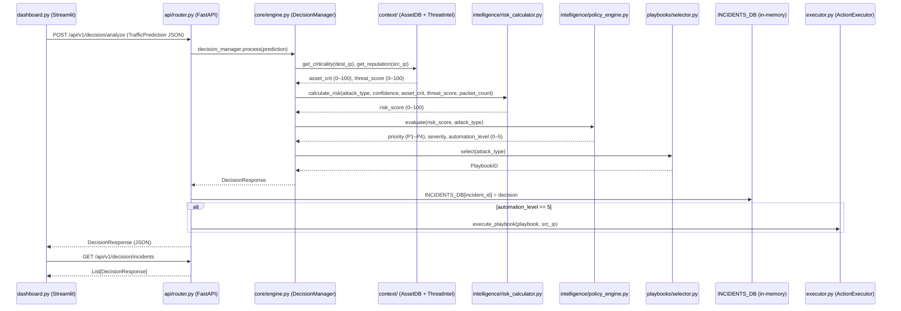

# Smart SOC Manager: Decision Engine
## Enterprise Software Design & Technical Architecture Document

---

## Document Control
| Version | Date | Author | Description |
|---------|------|--------|-------------|
| 1.0 | 2026-07-30 | AI Architect | Initial Architecture Design for Decision Engine |
| 2.0 | 2026-07-31 | AI Architect | Updated to reflect actual codebase implementation |

---

## Chapter 1: Introduction

### 1.1 What is a SOC?
A Security Operations Center (SOC) is a centralized function within an organization employing people, processes, and technology to continuously monitor and improve an organization's security posture while preventing, detecting, analyzing, and responding to cybersecurity incidents.

### 1.2 Security Incident Response
Incident Response (IR) is the methodology an organization uses to respond to and manage a cyberattack. An effective IR strategy aims to limit damage, reduce recovery time, and mitigate costs. Traditional IR relies heavily on manual log analysis, which is slow and error-prone.

### 1.3 Why Decision Engines are Required
As network traffic volumes and attack sophistication increase, human analysts suffer from "alert fatigue." A Decision Engine sits at the core of an autonomous SOC, bridging the gap between detection (AI/ML models) and response. It contextualizes alerts, calculates risks, and determines the best course of action without human intervention.

### 1.4 Problems with Manual Incident Response
* **Alert Fatigue:** Analysts are overwhelmed by thousands of daily alerts, many of which are false positives.
* **Slow Response Times:** Manual triage takes minutes to hours, giving attackers time to exfiltrate data or disrupt services.
* **Inconsistent Decisions:** Different analysts may respond to the same threat differently based on their experience level.

### 1.5 Need for Automated Decision Making
Automated decision-making brings machine-speed response to cybersecurity. By using deterministic logic and context enrichment, the Decision Engine ensures consistent, immediate, and accurate remediation of threats like DoS floods and brute force attacks.

---

## Chapter 2: Decision Engine Fundamentals

### 2.1 Definition
The Decision Engine is the centralized intelligence module of the Smart SOC Manager. It receives predictions from the ML layer, evaluates the context, calculates a risk score, and determines the optimal remediation strategy.

### 2.2 Objectives
* Eliminate false positives from escalating to Tier 1 analysts.
* Provide machine-speed responses to high-confidence attacks.
* Standardize incident response procedures via automated playbooks.

### 2.3 Scope
The scope of this engine includes ingesting ML predictions, prioritizing incidents, recommending actions, enforcing automation levels, and logging all automated decisions. It does NOT include ML training or actual execution of firewall rules (handled by `executor.py` — `ActionExecutor`).

### 2.4 Responsibilities
* **Contextualization:** Gathering asset criticality (`AssetDB`) and threat intelligence (`ThreatIntel`).
* **Risk Assessment:** Generating a dynamic risk score via `RiskCalculator`.
* **Policy Enforcement:** Deciding the automation level (0–5) via `PolicyEngine` / `RulesEngine`.
* **Playbook Selection:** Mapping the attack type to a specific `PlaybookID`.
* **Incident Logging:** Storing decisions in the in-memory `INCIDENTS_DB` via the API layer.

### 2.5 Inputs and Outputs
**Inputs (`TrafficPrediction` schema):**
- `attack_type` (str) — e.g., `"DoS SYN Flood"`
- `confidence` (float) — 0.0–100.0
- `flow_context` (`NetworkFlow`) — `src_ip`, `dest_ip`, `src_port`, `dest_port`, `protocol`, `packet_count`, `flow_duration`, `timestamp`

**Outputs (`DecisionResponse` schema):**
- `incident_id`, `attack_type`, `confidence`, `risk_score`, `severity`, `priority`
- `recommended_action`, `playbook` (`PlaybookID`), `automation_level`, `incident_status`
- `analyst_required`, `generated_time`, `src_ip`

### 2.6 Supported Attack Types
| Enum Value | String Label | Playbook |
|---|---|---|
| `BENIGN` | `Benign Traffic` | `PB-NET-000-BENIGN` |
| `BRUTE_FORCE` | `Dictionary Brute Force` | `PB-ID-001-BRUTEFORCE` |
| `DNS_FLOOD` | `DoS DNS Flood` | `PB-NET-002-DNS-FLOOD` |
| `ICMP_FLOOD` | `DoS ICMP Flood` | `PB-NET-003-ICMP-FLOOD` |
| `SYN_FLOOD` | `DoS SYN Flood` | `PB-NET-004-SYN-FLOOD` |
| `UDP_FLOOD` | `DoS UDP Flood` | `PB-NET-005-UDP-FLOOD` |

### 2.7 Requirements
* **Functional:** Must evaluate rules in < 50ms. Must support JSON REST API. Must log to in-memory DB (extensible to persistent DB).
* **Non-Functional:** High availability (99.99%), horizontally scalable, secure (encrypted data in transit).

---

## Chapter 3: Enterprise SOAR Research

### 3.1 Cortex XSOAR Decision Logic
Palo Alto's Cortex XSOAR uses highly customizable playbooks based on YAML and Python scripts. Its decision engine evaluates incident data against playbook conditions in real-time, relying on pre-built integrations for context enrichment.

### 3.2 Microsoft Sentinel Automation Rules
Sentinel uses Automation Rules to centrally manage automation. It triggers Azure Logic Apps (playbooks) based on incident creation, alerts, or analytics rules. Its decision logic is highly integrated with Azure Active Directory and Microsoft Graph.

### 3.3 Splunk SOAR Playbooks
Formerly Phantom, Splunk SOAR uses Visual Playbook Editor (VPE) which translates to Python code. It excels at orchestration, using decision blocks (if/else) based on normalized CEF (Common Event Format) data.

### 3.4 IBM QRadar SOAR
QRadar SOAR uses a dynamic "Incident Response Plan" that adapts as new information is uncovered. Its decision engine utilizes "Rules" and "Scripts" to trigger specific phases of a playbook automatically.

### 3.5 Architectural Comparison & Application
Modern SOAR platforms separate the **Event Ingestion**, **Decision/Logic**, and **Orchestration** layers. This Smart SOC Manager adopts this decoupled architecture. The Decision Engine acts as the central router: parsing the event, applying static/dynamic rules, and assigning a playbook before passing it to the Orchestration layer (`ActionExecutor`).

---

## Chapter 4: Decision Engine Architecture

The architecture is highly modular, ensuring each component handles a single responsibility. There are **two parallel implementations** in this codebase: a legacy flat layout (`core/`, `intelligence/`, `context/`, `playbooks/`) and a refactored package layout (`decision_engine/`). The API layer (`api/router.py`) currently uses the legacy `core/engine.py` (`DecisionManager`).

### 4.1 File System Layout

```
decisionEngineSoc/
│
├── main.py                         # Entry point: launches FastAPI + Streamlit via subprocess
├── dashboard.py                    # Streamlit frontend — Traffic Simulator + Incident Table
├── executor.py                     # ActionExecutor — simulates firewall/rate-limit/IAM actions
├── requirements.txt                # Python dependencies
│
├── api/
│   ├── router.py                   # FastAPI app — /analyze, /incidents, /approve endpoints
│   └── schemas.py                  # Pydantic models: NetworkFlow, TrafficPrediction, DecisionResponse
│
├── models/
│   └── enums.py                    # AttackType, Severity, PlaybookID, IncidentStatus enums
│
├── core/
│   ├── engine.py                   # DecisionManager (used by API) — orchestrates full pipeline
│   └── config.py                   # Risk weight constants and BASE_SEVERITIES map
│
├── context/
│   ├── asset_db.py                 # AssetDB — mock CMDB, returns criticality score (0–100)
│   └── threat_intel.py             # ThreatIntel — mock TIP, returns reputation score (0–100)
│
├── intelligence/
│   ├── risk_calculator.py          # RiskCalculator — weighted risk formula
│   └── policy_engine.py            # PolicyEngine — maps risk score → priority/severity/auto_level
│
├── playbooks/
│   └── selector.py                 # PlaybookSelector — maps AttackType enum → PlaybookID enum
│
├── decision_engine/                # Refactored standalone package (not yet wired to API)
│   ├── core/
│   │   ├── engine.py               # DecisionManager (dict-based, self-contained)
│   │   └── rules_engine.py         # RulesEngine — priority-sorted Rule dataclasses
│   ├── context/
│   │   └── enricher.py             # ContextEnricher — static methods, inline mock DBs
│   ├── intelligence/
│   │   └── risk_calculator.py      # RiskCalculator — classmethod-based, inline SEVERITY_MAP
│   └── playbooks/
│       └── registry.py             # PlaybookSelector + PLAYBOOK_REGISTRY dict
│
└── tests/
    ├── test_api.py                 # API integration tests
    ├── test_engine.py              # Engine unit tests
    └── malicious_payloads.json     # Sample attack payloads for testing
```

### 4.2 Module Responsibilities

| Module | Class | Responsibility |
|---|---|---|
| `api/router.py` | `FastAPI app` | REST endpoints; stores decisions in `INCIDENTS_DB` |
| `api/schemas.py` | `TrafficPrediction`, `DecisionResponse` | Pydantic I/O validation |
| `models/enums.py` | `AttackType`, `Severity`, `PlaybookID`, `IncidentStatus` | Typed constants |
| `core/engine.py` | `DecisionManager` | Pipeline orchestrator (used by API) |
| `context/asset_db.py` | `AssetDB` | Returns asset criticality by dest IP |
| `context/threat_intel.py` | `ThreatIntel` | Returns threat reputation by src IP |
| `intelligence/risk_calculator.py` | `RiskCalculator` | Weighted risk score formula |
| `intelligence/policy_engine.py` | `PolicyEngine` | Risk → priority / severity / automation level |
| `playbooks/selector.py` | `PlaybookSelector` | AttackType → PlaybookID mapping |
| `executor.py` | `ActionExecutor` | Simulates firewall block / rate-limit / IAM reset |
| `dashboard.py` | Streamlit app | Live incident table, risk chart, manual approval UI |
| `decision_engine/core/rules_engine.py` | `RulesEngine` | Priority-sorted rule evaluation → automation level |

### 4.3 Risk Score Formula

```
Risk = (W1 × BaseSeverity) + (W2 × Confidence) + (W3 × AssetCriticality)
     + (W4 × ThreatIntelScore) + (W5 × FrequencyModifier)

Weights (core/config.py):
  W1 = 0.35  (Base Severity)
  W2 = 0.25  (Confidence)
  W3 = 0.20  (Asset Criticality)
  W4 = 0.10  (Threat Intel)
  W5 = 0.10  (Frequency / Packet Count)

FrequencyModifier:
  packet_count > 10,000 → 100
  packet_count >  1,000 → 50
  else                  → 0

Result clamped to [0, 100].
```

### 4.4 Automation Level Matrix

| Level | Condition | Status | Analyst Required |
|---|---|---|---|
| 0 | Benign traffic | `DROPPED` | No |
| 1 | Whitelisted IP / default fallback | `LOGGED` | No |
| 2 | Low confidence (≤ 90%) | `PENDING_APPROVAL` | Yes |
| 3 | High confidence, low risk | `PENDING_APPROVAL` | Yes |
| 4 | High confidence + high risk + critical asset | `PENDING_APPROVAL` | Yes |
| 5 | High confidence + high risk + non-critical asset | `AUTO_MITIGATED` | No |

### 4.5 Architecture Diagram

```text
+-----------------------------------------------------------------------------------+
|                               SMART SOC MANAGER                                   |
+-----------------------------------------------------------------------------------+
|                                                                                   |
|   dashboard.py (Streamlit)          main.py (subprocess launcher)                |
|   - Traffic Simulator               - Starts FastAPI on :8000                    |
|   - Incident Table / Charts         - Starts Streamlit                           |
|   - Manual Approval UI              |                                            |
|          |                          |                                            |
|          v                          v                                            |
|   +----------------------------------------------+                              |
|   |           api/router.py  (FastAPI)            |                              |
|   |  POST /api/v1/decision/analyze                |                              |
|   |  GET  /api/v1/decision/incidents              |                              |
|   |  POST /api/v1/decision/approve                |                              |
|   |  In-memory INCIDENTS_DB                       |                              |
|   +-------------------+--------------------------+                              |
|                       |                                                          |
|                       v                                                          |
|   +----------------------------------------------+                              |
|   |         core/engine.py  (DecisionManager)     |                              |
|   |                                               |                              |
|   |  1. context/asset_db.py   → AssetDB           |                              |
|   |     get_criticality(dest_ip) → 0–100          |                              |
|   |                                               |                              |
|   |  2. context/threat_intel.py → ThreatIntel     |                              |
|   |     get_reputation(src_ip)  → 0–100           |                              |
|   |                                               |                              |
|   |  3. intelligence/risk_calculator.py           |                              |
|   |     calculate_risk(...)     → 0–100           |                              |
|   |                                               |                              |
|   |  4. intelligence/policy_engine.py             |                              |
|   |     evaluate(risk, attack)  → P1–P4,          |                              |
|   |                               severity,       |                              |
|   |                               auto_level 0–5  |                              |
|   |                                               |                              |
|   |  5. playbooks/selector.py  → PlaybookSelector |                              |
|   |     select(attack_type)    → PlaybookID       |                              |
|   |                                               |                              |
|   |  6. Returns DecisionResponse                  |                              |
|   +-------------------+--------------------------+                              |
|                       |                                                          |
|          auto_level==5|                                                          |
|                       v                                                          |
|   +----------------------------------------------+                              |
|   |         executor.py  (ActionExecutor)         |                              |
|   |  block_ip_firewall()                          |                              |
|   |  apply_rate_limiting()                        |                              |
|   |  reset_user_credentials()                     |                              |
|   +----------------------------------------------+                              |
|                                                                                   |
|   +-----------------------------------------+                                   |
|   |  decision_engine/  (standalone package) |  ← Not yet wired to API           |
|   |  core/engine.py     DecisionManager     |                                   |
|   |  core/rules_engine.py  RulesEngine      |                                   |
|   |  context/enricher.py   ContextEnricher  |                                   |
|   |  intelligence/risk_calculator.py        |                                   |
|   |  playbooks/registry.py PlaybookSelector |                                   |
|   +-----------------------------------------+                                   |
+-----------------------------------------------------------------------------------+
```

### 4.6 UML Sequence Diagram



### 4.7 API Endpoints

| Method | Path | Description |
|---|---|---|
| `POST` | `/api/v1/decision/analyze` | Submit ML prediction → returns `DecisionResponse` |
| `GET` | `/api/v1/decision/incidents` | Retrieve all logged incidents |
| `POST` | `/api/v1/decision/approve` | Manually approve a `PENDING_APPROVAL` incident |
| `GET` | `/docs` | Interactive Swagger UI (auto-redirect from `/`) |

---

## Chapter 5: Data Models

### 5.1 Input — `TrafficPrediction`
```json
{
  "attack_type": "DoS SYN Flood",
  "confidence": 97.5,
  "flow_context": {
    "timestamp": "2026-07-31T10:00:00Z",
    "src_ip": "203.0.113.50",
    "dest_ip": "10.0.0.5",
    "src_port": 12345,
    "dest_port": 80,
    "protocol": "TCP",
    "packet_count": 15000,
    "flow_duration": 2.5
  }
}
```

### 5.2 Output — `DecisionResponse`
```json
{
  "incident_id": "INC-a1b2c3d4",
  "attack_type": "DoS SYN Flood",
  "confidence": 97.5,
  "risk_score": 88.25,
  "severity": "CRITICAL",
  "priority": "P1",
  "recommended_action": "Automatically Applied Playbook Mitigations.",
  "playbook": "PB-NET-004-SYN-FLOOD",
  "automation_level": 5,
  "incident_status": "AUTO_MITIGATED",
  "analyst_required": false,
  "generated_time": "2026-07-31T10:00:00.123456Z",
  "src_ip": "203.0.113.50"
}
```

---

## Chapter 6: Running the System

### 6.1 Install Dependencies
```bash
pip install -r requirements.txt
```

### 6.2 Start Both Services
```bash
python main.py
```
- FastAPI backend: `http://127.0.0.1:8000`
- Streamlit dashboard: `http://localhost:8501`

### 6.3 Start Individually
```bash
# API only
python main.py --api-only

# Dashboard only
python main.py --dashboard-only
```

### 6.4 Run Tests
```bash
pytest tests/
```
