# Smart SOC Manager: Autonomous Decision Engine

An enterprise-grade, deterministic **SOC Decision Engine** for automated cyber-threat triage, risk scoring, and remediation orchestration.

Designed to bridge the gap between Machine Learning threat detection and autonomous SOAR actions, eliminating alert fatigue and enabling machine-speed incident response.

---

## Key Features

- **11-Stage Autonomous Orchestration Pipeline:**
  1. Threat Event Validation (Strict Pydantic schema validation & legacy flat payload normalization)
  2. Context Enrichment (Observed telemetry, Derived metrics, and Configured CMDB/TIP data)
  3. Explainable Risk Scoring (Normalized 0–100 score with granular mathematical factor contributions)
  4. Policy Evaluation & Priority Resolution (Declarative YAML policies with deterministic priority arbitration)
  5. Decision Generation & Level Allocation (Automation levels 0 to 5, SOC analyst escalation flags)
  6. Playbook Orchestration (Config-driven multi-step response workflows in `playbooks.yaml`)
  7. Safe Action Execution (SIMULATION & PRODUCTION execution modes, strict action allowlists)
  8. Outcome Verification (Automated traffic drop percentage vs. expected threshold comparison)
  9. Recovery, Rollback & Escalation (Stateful action duration tracking, auto-rollback, and timeout escalation)
  10. Stateful Incident Management (Sliding time-window deduplication, persistent state machine)
  11. Forensic Audit Trail & Event Bus (Immutable SQLite WAL-mode audit logging and real-time SSE streaming)
- **Dual Ingestion Modes (Live Hardware & Realistic Replay):**
  - **`LIVE_NFSTREAM`**: Live hardware packet capture from network interfaces (e.g. `en0`) using `nfstream` (requires `libpcap` on macOS/Linux).
  - **`SIMULATED_DATASET_REPLAY`**: High-fidelity flow replay directly from the real CICIDS2017 dataset via `IDSBridge.stream_continuous()`.
  - The active mode is dynamically exposed via `GET /api/v1/sensor/status`.
- **Enterprise Streamlit SOAR Command Center:** Live incident registry, explainable decision inspector, active mitigation monitor, manual approval actions, and forensic audit stream.

---

## End-to-End Operational Workflow

SmartSOC executes a closed-loop, machine-speed incident response workflow that connects live network traffic bursts and DoS flood simulations directly to Random Forest inference and autonomous SOAR playbook containment.

```mermaid
flowchart LR
    subgraph S1 [1. Ingestion]
        A[Traffic / Flood Generator<br/>CLI / Dashboard / Sensor] --> B[Flow Telemetry Tracker<br/>Packets, Duration, Rate, Ports]
    end

    subgraph S2 [2. RF Detect]
        B --> C[73-Feature Vector Mapper<br/>StandardScaler Normalization]
        C --> D[100-Tree Random Forest<br/>Threat Prediction & Confidence]
    end

    subgraph S3 [3. Context]
        D --> E[CMDB Asset Enrichment<br/>Asset Criticality: 85 HIGH]
    end

    subgraph S4 [4. Risk Engine]
        E --> F[Multi-Factor Risk Scoring<br/>0-100 Mathematical Score]
    end

    subgraph S5 [5. Policy Match]
        F --> G[Declarative Policy Engine<br/>Priority & SLA Arbitration]
    end

    subgraph S6 [6. SOAR Playbook]
        G --> H[Playbook Engine<br/>Containment Step Generation]
    end

    subgraph S7 [7. Mitigation]
        H --> I[Action Executor<br/>BLOCK_IP & Rate Limiting]
        I --> J[Outcome Verification<br/>Traffic Reduction Checked]
    end

    J --> K[(SQLite WAL / Live Console)]
```



### The 7 Core Operational Stages

1. **Stage 1: Traffic Ingestion & Flow Measurement (`Ingestion`)**
   - Network packets are generated via multi-threaded flood simulation (`dos_simulation.py` or the dashboard control deck) or live hardware capture (`nfstream`).
   - The thread-safe telemetry reporter tracks elapsed duration, packet counts, throughput rate (packets/sec), and 5-tuple socket endpoints.
   - Incremental flow vectors are written into SQLite (`threat_events`) every 0.25s for real-time console streaming.

2. **Stage 2: 100-Tree Random Forest ML Threat Classification (`RF Detect`)**
   - Telemetry is mapped into the 73-dimensional statistical feature vector expected by the model (`Flow Duration`, `Total Fwd Packet`, `Flow Packets/s`, ports, packet length distributions, and inter-arrival times).
   - Normalized using `StandardScaler` (`scaler.pkl`).
   - Evaluated across 100 decision trees (`model.pkl`) to predict the threat category and confidence probability across 10 threat classes (e.g. `DoS SYN Flood`, `DoS UDP Flood`, `Recon Host Discovery`, `Benign Traffic`).

3. **Stage 3: Context Enrichment & Asset Criticality (`Context`)**
   - Enriches the threat event with internal CMDB and network topography context.
   - Resolves target host vulnerability profile, active service exposure, and asset criticality (e.g. `127.0.0.1` evaluated at Criticality `85/100` [HIGH]).

4. **Stage 4: Multi-Factor Contextual Risk Scoring (`Risk Engine`)**
   - Computes a deterministic, explainable risk score (0.0 to 100.0) combining:
     - ML model confidence and threat classification severity
     - Target asset criticality score
     - Observed volumetric intensity (pps) and protocol exposure

5. **Stage 5: Declarative Policy Matching & SLA Resolution (`Policy Match`)**
   - Evaluates declarative rules from `decision_engine/config/policies.yaml`.
   - Resolves priorities and SLAs (e.g., `DOS-SYN-001`, `RECON-HOST-001`, `DEFAULT-FALLBACK`).
   - Determines automation level (Level 1–5: Human-in-the-Loop vs Autonomous Machine-Speed Mitigation).

6. **Stage 6: Autonomous SOAR Playbook Orchestration (`SOAR Playbook`)**
   - Dispatches the matched playbook (e.g., `PB-DOS-SYN`, `PB-RECON-HOST`, `PB-DEFAULT`).
   - Executes multi-step containment actions via the Action Subsystem (`CREATE_INCIDENT`, `BLOCK_IP`, `RATE_LIMIT_SUBNET`, `NOTIFY_ANALYST`).

7. **Stage 7: Closed-Loop Mitigation & Real-Time Sync (`Mitigation`)**
   - Verifies post-mitigation traffic drop against expected baseline reduction thresholds.
   - Updates the persistent incident state machine (`DETECTED` $\rightarrow$ `TRIAGING` $\rightarrow$ `RISK_ASSESSED` $\rightarrow$ `POLICY_MATCHED` $\rightarrow$ `MONITORING` / `RESOLVED`).
   - Emits real-time state transitions through `WorkflowTracker` (`live_workflow.json`), dynamically illuminating the console DAG pipeline stepper and alerting security analysts.

## Project Structure

```
decisionEngineSoc/
├── main.py                         # Application launcher (FastAPI + Streamlit + optional feed)
├── dashboard.py                    # Streamlit Enterprise SOAR Command Center & Live Monitor
├── run_pipeline.py                 # Unified End-to-End Pipeline Runner (NFStream -> RF -> SOAR)
├── run_ids_feed.py                 # Continuous IDS Telemetry Streaming CLI
├── requirements.txt                # Python dependencies
├── README.md                       # Project documentation
├── RUN_GUIDE.md                    # Exhaustive file-by-file manual & run guide
│
├── aiml/                           # Integrated AI/ML Intrusion Detection System
│   ├── model.pkl                   # Serialized Random Forest Classifier (100 trees, 10 classes)
│   ├── scaler.pkl                  # StandardScaler fitted on 73 network flow features
│   ├── label_encoder.pkl           # LabelEncoder for 10 attack categories
│   ├── feature_names.pkl           # 73 flow feature names list
│   ├── dataset/                    # CICIDS2017 flow dataset (cleaned CSV)
│   ├── train_model.py              # Script to re-train the Random Forest classifier
│   ├── preprocess.py               # Dataset preprocessing, scaling, and SMOTE balancing
│   ├── evaluate.py                 # Confusion matrix, classification report & F1 metrics
│   └── simulate.py                 # Local standalone batch inference simulator
│
├── decision_engine/                # Production SOAR Decision Engine Module
│   ├── api/                        # FastAPI REST service & SSE live stream generator
│   │   ├── routes.py               # /analyze, /incidents, /traffic, /traffic/flagged, /approve
│   │   └── streaming.py            # Real-time SSE generator for dashboard live feeds
│   ├── integrations/               # Sensor & ML Bridge Layer
│   │   ├── ids_bridge.py           # Bridge loading Random Forest model & predicting flows
│   │   ├── nfstream_sensor.py      # Live hardware / interface packet sniffer (en0)
│   │   └── flagged_logger.py       # Dedicated logger for flagged flows (logs/nfstream_flagged.log)
│   ├── models/                     # Strongly-typed Pydantic v2 domain models
│   ├── config/                     # Declarative YAML configurations (risk, policies, playbooks)
│   ├── context/                    # Context enrichment engine (CMDB asset + TIP lookup)
│   ├── risk/                       # Explainable risk assessment engine (0-100 normalized)
│   ├── policy/                     # Declarative policy matcher with priority resolution
│   ├── playbooks/                  # Playbook workflow dispatcher and step executor
│   ├── actions/                    # Safe action execution subsystem (SimulationAdapter, etc.)
│   ├── verification/               # Closed-loop mitigation verification engine
│   ├── recovery/                   # Action lifecycle manager (rollback & escalation)
│   ├── incidents/                  # Stateful incident correlation & sliding window deduplication
│   ├── storage/                    # Persistent SQLite storage with WAL mode & thread-local connections
│   ├── audit/                      # Forensic audit logging system
│   └── decision/                   # DecisionManager master pipeline orchestrator
│
├── logs/                           # Runtime logs
│   ├── nfstream_flagged.log        # All suspicious flows flagged by NFStream & RF model
│   └── nfstream_all_flows.log      # Complete flow log (Normal + Flagged)
│
├── scripts/                        # Attack simulations & standalone demo scripts
│   ├── dos_simulation.py           # Multi-threaded DoS simulation & RF classification
│   ├── run_demo.py                 # Standalone Port Flood -> Detect -> Decide -> Respond demo
│   └── verify_live_capture.py      # Live interface flow verification
├── docs/                           # Architectural specifications & simulation guide
└── tests/                          # Automated Pytest suite (47 tests passing)
    ├── test_decision_engine.py     # Decision Engine pipeline & lifecycle tests
    ├── test_ids_bridge.py          # AI/ML Random Forest integration tests (all 10 attack classes)
    ├── test_api.py                 # REST API integration tests (including flagged traffic)
    ├── test_model_routes.py        # Dedicated AI/ML prediction & architecture endpoints
    └── test_engine.py              # Pipeline execution and model validation tests
```

---

## Quickstart

### 1. Installation

Ensure Python 3.10+ is installed:

```bash
pip install -r requirements.txt
```

### 2. Run the Unified End-to-End Pipeline

Execute the full connected workflow from raw network flow to Random Forest prediction, flagged flow logging, and automated policy remediation:

```bash
python run_pipeline.py --samples 15 --delay 0.5
```

### 3. Launch the Complete SOAR Platform

Run the FastAPI backend, Streamlit Command Center, and live IDS ingestion feed together:

```bash
# Full stack: FastAPI + Streamlit Dashboard + Live Feed
python main.py --with-feed

# Or run without background feed:
python main.py
```

- **Streamlit Command Center:** [http://localhost:8501](http://localhost:8501)
- **FastAPI Interactive Docs:** [http://127.0.0.1:8000/docs](http://127.0.0.1:8000/docs)
- **Flagged Flows Endpoint:** [http://127.0.0.1:8000/api/v1/traffic/flagged](http://127.0.0.1:8000/api/v1/traffic/flagged)

---

## Running Tests

Execute the automated test suite with pytest:

```bash
pytest tests/ -v
```
All 36 tests will pass out of the box with zero external dependencies.

---

## Documentation

- [Master Run & File Guide](RUN_GUIDE.md): **All commands** to launch, test, and stream traffic, with an exhaustive file-by-file breakdown.
- [Architecture Design Document](docs/architecture.md): Complete specification of system components, mathematical formulas, and sequence diagrams.
- [Simulation Guide](docs/simulation_guide.md): Code examples and step-by-step instructions for simulating network attack traffic.
